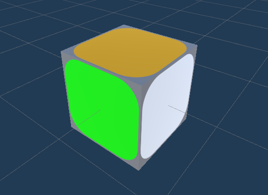
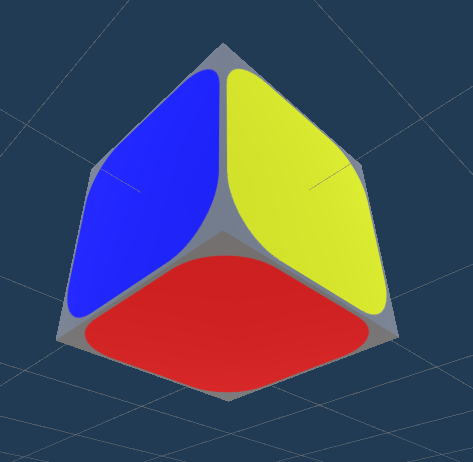

# **_RubiksCube_**

By: Theo RITOUNI and Quentin BLEUSE

Released the : 20/12/2020

## **Description**

This project consist in developing a Rubiks Cube in Unity,
with the goal of using Quaternions and not using transform's rotation.

## **How To Build**

As the project is made on Unity, you can build the project using Unity (the project runs on Unity 2019.4.14.f1)  and rebuild the project using unity's build system. Or...

## **How To Run**

You can run the already available build in the Build/ folder by simply double clicking on it.

## **Features**

This project features:

- Procedural generation of the rubiks cube to a certain size
- UI permitting to choose the referenced above size and the complexity (the number of random shuffle) of the cube
- Rotating the cube on it self with the mouse's right button
- Rotating a face on itself with mouse's left button
- A button to restart whenever user want
- A Message that says when the cube is solved
- Screenshots/ folder with all the gif and images use to illustrate this readme
- a build in the Build/ folder

## **Known Bugs**

It appears that when the cube is been trying to be solved for a very long time,
the cube dislocate itself for no apparent reason.
This bugs seems to happen at construction sometimes too.
The bug not being a simple one to reproduce, it has been left as it is.
If it ever happens,
we advice you to restart, and apology for the inconvenience.

## **Techniques Used**

- C# (as everything has been written on C#, but some specifics like Coroutines too)
- Unity's Quaternion, Vector and Plane struct.

## **Presentation**

Here is a presentation of how the project has been made, the problematic and how we solved them.
Each Section will be about how to implement one the feature listed above, except all of the UI features.

### **_Table Of Content:_**

- [_Cube Procedural Generation - How to represent a Rubiks Cube_](#cube-procedural-generation)

- [_Cube Solving - How a good representation helps_](#cube-solving)
  
- [_Cube Rotation - Making Rotation with Quaternion_](#-cube-rotation)
  
- [_Cube Face Rotation - Quaternion Imprecision Nightmare_](#cube-face-rotation)

______

### **_Cube Procedural Generation_**

A Rubiks Cube is a Cube made of other smaller cube that you can rotate around the center of it.
Now to implement this few questions rise up :  

#### _What is a smaller cube ?_

One smaller cube should have each face a different color, as the goal of a Rubiks Cube is to have each face of a certain color.
In Unity, it is not possible to create a cube with each face having a different color.
Then we will have a Prefabs Game Object being 6 faces of each different color.




#### _Where to spawn them ?_

Each face is composed of the same number of cube.
If "size" is the number of cube on a line then, there is the same number of cube on the column of this face and on all other face.
Which means that the Rubiks Cube's nb of smaller cube is at least of (size x size x size).
Or is it ?
In reality, inside the Rubiks Cube, there is no smaller cube but the mechanism that permits the cube to rotate.
Therefore we do not have to create cubes inside of the Rubiks cube, but only inside of it.

Here is a portion of The method [CreateCube](RUBIKSCUBE/Assets/Scripts/Rubikscube.cs#118):

``` csharp
 void CreateCube()
    {
        int i = 0;
        int j = 0;
        int k = 0;
        Vector3 pos = new Vector3(i, j, k);

        //construction of cube 
        for (; i < size; i++)
        {
            pos.x = i;
            for (j = 0; j < size; j++)
            {
                pos.y = j;
                for (k = 0; k < size; k++)
                {
                    pos.z = k;
                    if (!((pos.x < size - 1 && pos.x > 0)
					&& (pos.y < size - 1 && pos.y > 0) 
					&& (pos.z < size - 1 && pos.z > 0)))
                        tabCube.Add(Instantiate(cubeMulti, pos, Quaternion.identity));
                }
            }
        }

		...
```

It is a simple method that just spawn a cube if each coordinate is equal 0 or size, which means the nb of cube that we have is less than size x size x size, it is (8 [nb of corner cubes] + 12 [nb of edges of the cube] x (size - 2) + 6 x (size - 2)²).
With that we get this result :


And when we changed the size we get that:


we have less cube than with a simple one with this method which is always appreciated and we have a cube!
Note that by having no rotation applied to the cube the cube is already solved.
It is thanks to the fact that each face has a different color, we do not have to do nothing to choose the color or anything.

________

### **_Cube Solving_**

As we saw above, thanks to our definition of a cube, the solve cube is a cube where all the smaller cube have the same rotation, so here is the method [CheckCompleted](RUBIKSCUBE/Assets/Scripts/Rubikscube.cs#231), that checks if the Rubiks Cube has been solved:

``` csharp

    void CheckCompleted()
    {
        foreach (GameObject cube in tabCube)
        {
            foreach (GameObject comparedCube in tabCube)
            {
                if (!(Quaternion.Angle(cube.transform.rotation, comparedCube.transform.rotation) <= checkCompletedEpsilon))
                {
                    completed = false;
                    return;
                }
            }
        }

        completed = true;
    }

```

Fairly simple, once again. It just checks between the angle of rotations of each cubes is greater than an epsilon, if it is, then at least one cube is not in the good rotation which means it is not solved.
Here is an example of what we can see in game:


___

### **_Cube Rotation_**

The goal of this project was to use the Quaternions to do rotations, here we have the rotation of the cube on itself to allow the user to look at the cube in every orientation he wants.
When the cube rotate on itself, we need to rotate every single smaller cube of the Rubiks cube, or we can...
Here is the end of the method [CreateCube](RUBIKSCUBE/Assets/Scripts/Rubikscube.cs#L118):

````csharp

    ...

        //set parent of cube
        foreach (GameObject tab in tabCube)
        {
            tab.transform.parent = centralPos.transform;
        }

        myRotatePoint.transform.parent = centralPos.transform;
    }

````

We can otherwise put every cube in children of a game object to rotate only it when we want to rotate the cube.
Do not care about "myRotatePoint" for now it is for something else.

Now, we have a GameObject that rotate each smaller cube when we rotate it.
Remains to rotate the point using the quaternions.

We know that multiplying normalized quaternions rotates from an orientation to another, we just have to match the rotation to user's mouse movement.
Here is the [RotateCube](RUBIKSCUBE/Assets/Scripts/Rubikscube.cs#L194):

````csharp

    void RotateCube()
    {
        Vector3 mouseMove = Input.mousePosition - previousMousePos;

        if (Input.GetButton("Fire2") && !animRunning)
        {
            Vector3 rotAxis         = new Vector3(mouseMove.y, -mouseMove.x, 0);
            float rotAngle          = rotAngularSpeed / maxRotAngleDuringOneFrame;

            Quaternion rotQ         = Quaternion.AngleAxis(rotAngle, rotAxis);

            targetOrientationQuat   = rotQ * targetOrientationQuat;
        }

        centralPos.transform.rotation   = targetOrientationQuat;
        previousMousePos                = Input.mousePosition;

        chooseRotatePlane   = false;
        rightHolding        = false;
    }

````

We choose the axis with the movement of the mouse between two frames and we rotate the point's orientation which will affect all the children.

Here is the result:


Another reason to rotate the cube and not the camera is to make the zoom by changing just the coordinate of the position of the camera on an axis.
Here is the [Zoom](RUBIKSCUBE/Assets/Scripts/Rubikscube.cs#L215):

````csharp

    void Zoom()
    {
        // zoom camera
        if (Input.GetAxis("Mouse ScrollWheel") < 0)
        {
            if (savePosCam.z - limitZoom < mainCamera.transform.position.z)
                mainCamera.transform.position -= new Vector3(0, 0, zoomSpeed * Time.deltaTime);
        }

        if (Input.GetAxis("Mouse ScrollWheel") > 0)
        {
            if (savePosCam.z + limitZoom > mainCamera.transform.position.z)
                mainCamera.transform.position += new Vector3(0, 0, zoomSpeed * Time.deltaTime);
        }
    }

````

Once again, simple method, just moving the camera on the z axis with limitation.

Here is the Zoom in game:


___

### **_Cube Face Rotation_**

A Rubiks Cube wouldn't be a Rubiks Cube if you cannot rotate the faces to try to solve it,
so it is the main Mechanic of the game here, it needs to be done well.

With the goal in mind a lot of thing needs to be done, let's view them through questions:

#### _What is a face ?_

In a real Rubiks Cube, a face are all cubes linked with a mechanism inside, which make clear what is a face : it is all the cubes you can rotate with one mechanism.

But right now we have just a cube made of some other cubes, no mechanism makes clear what is a face.

But if we consider the problem with a mathematical insight, all cubes that rotate on a real Rubiks Cube are always on a same plane, We can then consider that a face is the all the cubes that can rotate on the plane chosen.

Leave the hard part : how do we choose this plane? let us see how it is done through code:

Here is [GetGrabedFace](RUBIKSCUBE/Assets/Scripts/Rubikscube.cs#L358) method:

```csharp

   /* Get the face that user was pointing the mouse at when pressing 
   left mouse button and create the ctrlPlane with it */
    void GetGrabedFace()
    {
        leftHolding = true;
        chooseRotatePlane = false;

        //Create a ray from the Mouse click position
        Ray ray = Camera.main.ScreenPointToRay(Input.mousePosition);
        RaycastHit hit;

        if (Physics.Raycast(ray, out hit))
        {
            oldPoint    = hit.point;
            grabedFace  = hit.collider.gameObject;
            ctrlPlane   = new Plane(grabedFace.transform.forward, grabedFace.transform.forward * Vector3.Dot(grabedFace.transform.forward, grabedFace.transform.position));
        }
    }

```

This a method that get the face that the mouse was on when clicking, it sets a lot other variable when it does that but the most important is saving grabedFace, setting oldPoint and ctrlPlane.
ctrlPlane is the Plane that the player will be moving his mouse on when rotating the face.

The answer to the question above is to simply get at least one of the cube in the plan wanting to rotate and to do that we simply ask to the user: as in a real Rubiks Cube the user rotate the face with their hands, our users will rotate a face with their mouse.

Now that we have a face we have limited the choice to three planes: the plane that will rotate the cube on this forward vector, the right vector or the up vector.

leaving the choice to three rotation will be ot complicated so we limit to two of them :
the up vector and the right vector.

Here is [ChooseMovingFace](RUBIKSCUBE/Assets/Scripts/Rubikscube.cs#L375) method:

```csharp
    bool ChooseMovingFace()
    {
        //Create a ray from the Mouse click position
        Ray ray = Camera.main.ScreenPointToRay(Input.mousePosition);
        RaycastHit hit;

        if (Physics.Raycast(ray, out hit))
        {
            Vector3 grabDist = (hit.point - oldPoint);
            if (grabDist.sqrMagnitude >= (float)size * faceTurnSensibility)
            {

                oldPoint        = hit.point;
                float upRate    = Mathf.Abs(Vector3.Dot(grabedFace.transform.up, grabDist));
                float rightRate = Mathf.Abs(Vector3.Dot(grabedFace.transform.right, grabDist));


                if (rightRate >= upRate)//if the user's mouse is more on the right axis then it is the up plane that moves
                {
                    movingPlane = new Plane(grabedFace.transform.up, grabedFace.transform.up * Vector3.Dot(grabedFace.transform.up, grabedFace.transform.position));
                    return true;
                }//else, if the user's mouse is more on the up axis, then the movingPlane is the right Plane

                movingPlane = new Plane(grabedFace.transform.right, grabedFace.transform.right * Vector3.Dot(grabedFace.transform.right, grabedFace.transform.position));
                return true;
            }
        }

        return false;
    }

```

By limiting the Rubiks Cube's Face to two rotations, we can just wait and listened for the user to choose : the plane of the rotation will be on the cross product between the vector of direction of mouse ad the vector forward of the face,
so basically if the mouse moves on the right axis,
the face rotates on the up axis,
otherwise if the mouse moves on the up axis,
the face rotates on the right axis.

And, with that, we have our face!

#### _How do we rotate our face ?_

Now, we have the plane that the cube rotates on but we still cannot rotate them, we need to get them.

Here is the beginning of the [GetCubeFromPlane](RUBIKSCUBE/Assets/Scripts/Rubikscube.cs#L417) method:

````csharp

    /* method that populate movingCube after the movingPlane been chose and place my Rotate Point, to rotate those cubes*/
    void GetCubeFromPlane()
    {
        foreach (GameObject gameObject in tabCube)
        {
            float distToPlane = movingPlane.GetDistanceToPoint(gameObject.transform.position);
            if (distToPlane <= detectEpsilon && distToPlane >= -detectEpsilon)
            {
                movingCube.Add(gameObject);
            }
        }

        ...

````

So to find them we check the distance to the plane, and put them in an array.
We have two ways to work around it: we move and rotate each cube separately or we rotate a temporary parent of each cube.

The first needs less variable but is more difficult to do, particularly the rotation that can give strange result as this example below:


So we decided to make the simpler one with a temporary parent, and thank you for your patience:
this is what is "myRotatePoint".

Here is the end of the  [GetCubeFromPlane](RUBIKSCUBE/Assets/Scripts/Rubikscube.cs#L417) method:

````csharp

        ...

        
        myRotatePoint.transform.position = Vector3.zero;
        myRotatePoint.transform.rotation = Quaternion.identity;
        foreach (GameObject cub in movingCube)
        {
            myRotatePoint.transform.position += cub.transform.position;
        }

        if (movingCube.Count != 0)
            myRotatePoint.transform.position /= movingCube.Count;

        foreach (GameObject cub in movingCube)
        {
            cub.transform.parent = myRotatePoint.transform;
        }
    }

````

We place the rotate point in the good place which is in the middle of all the cube, and we reset the rotation of the gameObject.

Now that we've got all the cube we need to rotate them, so Here is the [MoveFace](RUBIKSCUBE/Assets/Scripts/Rubikscube.cs#L444):

````csharp

    void MoveFace()
    {
        Vector3 newPoint = Input.mousePosition;

        float moveRate                      = Vector3.Dot(Vector3.Cross(ctrlPlane.normal, movingPlane.normal), (newPoint - oldPoint));
        myRotatePoint.transform.rotation    = SimpleRotate(myRotatePoint.transform.rotation, movingPlane.normal, faceTurnSpeed * (1.0f / (float)size), moveRate);

        oldPoint        = newPoint;
    }

````

And Here is [SimpleRotate](RUBIKSCUBE/Assets/Scripts/Rubikscube.cs#L349) method:

````csharp

    Quaternion SimpleRotate(Quaternion inOrientation, Vector3 rotateAxis, float rotateAngle, float slerpComponent = 1.0f)
    {
        Quaternion rotate = Quaternion.AngleAxis(rotateAngle, rotateAxis);
        rotate = Quaternion.SlerpUnclamped(Quaternion.identity, rotate, Time.deltaTime * slerpComponent);

        return inOrientation * rotate;
    }

````

Basically, we just multiplicate by a rotation that is of a fixed angle and slerp with the deltaTime and the dot product of the movement of mouse (which gives the direction of rotation).

Finally, We are good to rotate the face of our cube, Here we go: 


Hooray...?


I don't think we can even call this a Rubiks Cube anymore...

Well, that is disappointing... but it illustrates well some problem:

1. _We need to have quaternions with value we know, otherwise it will dislocate itself after few rotations._

2. _We need our rotations to be a multiple of pi/2 before making another rotation otherwise the cubes are going to drift away for a normal position._

We are going to do this with an animation (or more so a coroutine).

Here is the [SetBackProperly](RUBIKSCUBE/Assets/Scripts/Rubikscube.cs#L499) method:

````csharp

    IEnumerator SetBackProperly()
    {
        Quaternion properOrientation    = GetProperOrientation();
        animRunning                     = true;

        /* Slerp until between wanted rot and current rot is below epsilon */
        while (Quaternion.Angle(myRotatePoint.transform.rotation, properOrientation) >= animFinishedEpsilon)
        {
            myRotatePoint.transform.rotation = Quaternion.Slerp(myRotatePoint.transform.rotation, properOrientation, animTurnSpeed * 1.0f / (float)size * Time.deltaTime);

            yield return null;
        }

        myRotatePoint.transform.rotation = properOrientation;//then force the rotation to avoid drifting by quaternion.

        animRunning = false;
        ClearParent();//the movement is considered finished only when anim is finished

        yield break;
    }

````

This coroutine will disable any rotation of the user until it is finished and it slerp until it is close enough to the wanted orientation then affect it.

The fact it is a coroutine is just for the user to see what is being done which is make the face rotate to an orientation allowed, what we want is just the orientation to be one of the ones allowed, and this shows it.

It acts a bit like the mechanism inside a real Rubiks Cube that could not rotate if a face is not parallel with the other.

Let us see [GetProperOrientation](RUBIKSCUBE/Assets/Scripts/Rubikscube.cs#L474) method to understand fully how it works:

````csharp

    Quaternion GetProperOrientation()
    {
        /* list all possible rotation for the face */
        List<Quaternion> orientationQuaternion = new List<Quaternion>();
        orientationQuaternion.Add(Quaternion.identity);
        orientationQuaternion.Add(Quaternion.AngleAxis(90.0f, movingPlane.normal));
        orientationQuaternion.Add(Quaternion.AngleAxis(-90.0f, movingPlane.normal));
        orientationQuaternion.Add(Quaternion.AngleAxis(180.0f, movingPlane.normal));

        Quaternion returnQuat   = Quaternion.identity;
        float angle             = float.MaxValue;

        foreach (Quaternion quaternion in orientationQuaternion)
        {
            float newAngle = Quaternion.Angle(myRotatePoint.transform.rotation, quaternion);
            if (newAngle < angle)/* check for smallest angle between possible rotation and current one*/
            {
                angle       = newAngle;
                returnQuat  = quaternion;
            }
        }

        return returnQuat;
    }

````

We compare the angle between the rotation that the user has done and proper rotations which are 0, pi/2 pi and -pi/2 on the axis given, and choose the rotation with smallest angle out of them.

We could have used the dot product to do so.

And Finally! we have done it there it is:


It was a long run but it work pretty well, if we don't count few bugs, and really helped to learn how to use quaternions.

The code that we reviewed is just the core of how it works you can also see how the UI works in the [UIManager.cs](RUBIKSCUBE/Assets/Scripts/UIManager.cs) file, or see how the whole Rubiks Cube system works in the [Rubiks.cs](RUBIKSCUBE/Assets/Scripts/RubiksCube.cs) file.

Thank you for reading, and have fun !
