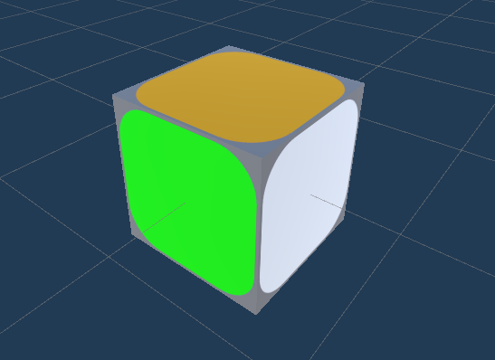
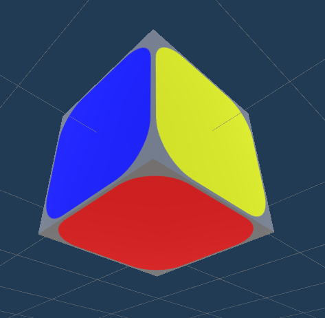

# **_RubiksCube_**

By: Theo RITOUNI and Quentin BLEUSE

Released the : 20/12/2020

## **Description**

This project consist in developing a Rubiks Cube in Unity,
with the goal of using Quaternions and not using transform's rotation.

## **How To Build**

As the project is made on Unity, you can build the project using Unity (the project runs on Unity 2019.4.14.f1)  and rebuild the project using unity's build system. Or...

## **How To Run**

You can run the already available build in the Build/ folder by simply double clicking on it.

## **Features**

This project features:

- Procedural generation of the rubiks cube to a certain size
- UI permitting to choose the referenced above size and the complexity (the number of random shuffle) of the cube
- Rotating the cube on it self with the mouse's right button
- Rotating a face on itself with mouse's left button
- A button to restart whenever user want
- A Message that says when the cube is solved

## **Known Bugs**

It appears that when the cube is been trying to be solved for a very long time,
the cube dislocate itself for no apparent reason.
The bug not being a simple one to reproduce, it has been left as it is.
If it ever happens,
we advice you to restart, and apology for the inconvenience.

## **Techniques Used**

- C# (as everything has been written on C#, but some specifics like Coroutines too)
- Unity's Quaternion, Vector and Plane struct.

## **Presentation**

Here is a presentation of how the project has been made, the problematic and how we solved them.
Each Section will be about how to implement one the feature listed above, except all of the UI features.

### **_Table Of Content:_**

- [_Cube Procedural Generation - How to represent a Rubiks Cube_](#cube-procedural-generation)

- [_Cube Solving - How a good representation helps_](#cube-solving)
  
- [_Cube Rotation - Making Rotation with Quaternion_](#-cube-rotation)
  
- _Cube Face Rotation - Quaternion Imprecision Nightmare_

______

### **_Cube Procedural Generation_**

A Rubiks Cube is a Cube made of other smaller cube that you can rotate around the center of it.
Now to implement this few questions rise up :  

#### _What is a smaller cube ?_

One smaller cube should have each face a different color, as the goal of a Rubiks Cube is to have each face of a certain color.
In Unity, it is not possible to create a cube with each face having a different color.
Then we will have a Prefabs Game Object being 6 faces of each different color.




#### _Where to spawn them ?_

Each face is composed of the same number of cube.
If "size" is the number of cube on a line then, there is the same number of cube on the column of this face and on all other face.
Which means that the Rubiks Cube's nb of smaller cube is at least of (size x size x size).
Or is it ?
In reality, inside the Rubiks Cube, there is no smaller cube but the mechanism that permits the cube to rotate.
Therefore we don't have to create cubes inside of the Rubiks cube, but only inside of it.

Here's a portion of The method [CreateCube](RUBIKSCUBE/Assets/Scripts/Rubikscube.cs#118):

``` csharp
 void CreateCube()
    {
        int i = 0;
        int j = 0;
        int k = 0;
        Vector3 pos = new Vector3(i, j, k);

        //construction of cube 
        for (; i < size; i++)
        {
            pos.x = i;
            for (j = 0; j < size; j++)
            {
                pos.y = j;
                for (k = 0; k < size; k++)
                {
                    pos.z = k;
                    if (!((pos.x < size - 1 && pos.x > 0)
					&& (pos.y < size - 1 && pos.y > 0) 
					&& (pos.z < size - 1 && pos.z > 0)))
                        tabCube.Add(Instantiate(cubeMulti, pos, Quaternion.identity));
                }
            }
        }

		...
```

It is a simple method that just spawn a cube if each coordinate is equal 0 or size, which means the nb of cube that we have is less than size x size x size, it is (8 [nb of corner cubes] + 12 [nb of edges of the cube] x (size - 2) + (size - 2)²).
With that we get this result :


And when we changed the size we get that:


we have less cube than with a simple one with this method which is always appreciated and we have a cube!
Note that by having no rotation applied to the cube the cube is already solved.
It is thanks to the fact that each face has a different color, we don't have to do nothing to choose the color or anything.

________

### **_Cube Solving_**

As we saw above, thanks to our definition of a cube, the solve cube is a cube where all the smaller cube have the same rotation, so here is the method [CheckCompleted](RUBIKSCUBE/Assets/Scripts/Rubikscube.cs#231), that checks if the Rubiks Cube has been solved:

``` csharp
    void CheckCompleted()
    {
        foreach (GameObject cube in tabCube)
        {
            foreach (GameObject comparedCube in tabCube)
            {
                if (!(Vector3.Distance(cube.transform.forward, comparedCube.transform.forward) <= checkCompletedEpsilon))
                {
                    completed = false;
                    return;
                }
            }
        }

        completed = true;
    }
```

Fairly simple, once again. It just checks if the distance between the forward vectors of each cubes is greater than an epsilon, if it is, then at least one cube is not in the good rotation which means it is not solved.
We could have checked between the angle of rotations, but the check is simpler with vectors.
Here is an example of what we can see in game:


___

### **_Cube Rotation_**

The goal of this project was to use the Quaternions to do rotations, here we have the rotation of the cube on itself to allow the user to look at the cube in every orientation he wants.
When the cube rotate on itself, we need to rotate every single smaller cube of the Rubiks cube, or we can...
Here is the end of the method [CreateCube](RUBIKSCUBE/Assets/Scripts/Rubikscube.cs#L118):

````csharp

    ...

        //set parent of cube
        foreach (GameObject tab in tabCube)
        {
            tab.transform.parent = centralPos.transform;
        }

        myRotatePoint.transform.parent = centralPos.transform;
    }

````

We can otherwise put every cube in children of a game object to rotate only it when we want to rotate the cube.
Do not care about "myRotatePoint" for now it is for something else.

Now, we have a GameObject that rotate each smaller cube when we rotate it.
Remains to rotate the point using the quaternions.

We know that multiplying normalized quaternions rotates from an orientation to another, we just have to match the rotation to user's mouse movement.
Here's the [RotateCube](RUBIKSCUBE/Assets/Scripts/Rubikscube.cs#L194):

````csharp

    void RotateCube()
    {
        Vector3 mouseMove = Input.mousePosition - previousMousePos;

        if (Input.GetButton("Fire2") && !animRunning)
        {
            Vector3 rotAxis         = new Vector3(mouseMove.y, -mouseMove.x, 0);
            float rotAngle          = rotAngularSpeed / maxRotAngleDuringOneFrame;

            Quaternion rotQ         = Quaternion.AngleAxis(rotAngle, rotAxis);

            targetOrientationQuat   = rotQ * targetOrientationQuat;
        }

        centralPos.transform.rotation   = targetOrientationQuat;
        previousMousePos                = Input.mousePosition;

        chooseRotatePlane   = false;
        rightHolding        = false;
    }

````

We choose the axis with the movement of the mouse between two frames and we rotate the point's orientation which will affect all the children.

Here's the result:


